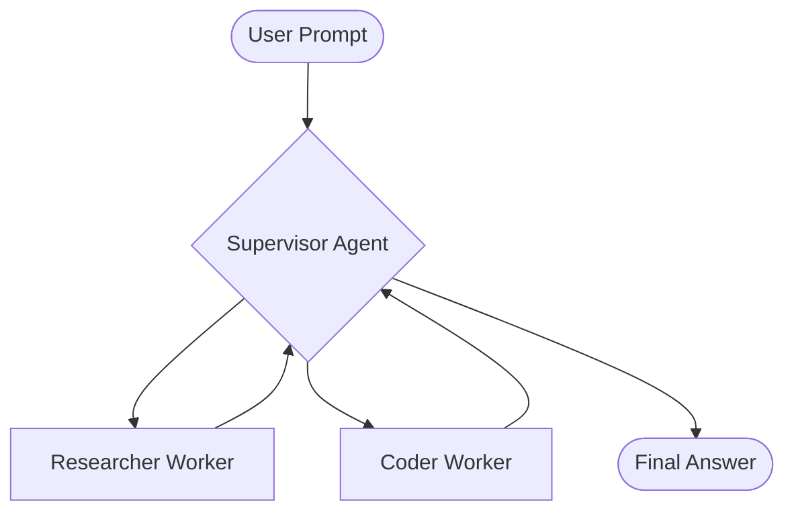

# 01. Agent Architectures: LangGraph & Topologies

This guide covers the advanced agent design patterns required for the Production Agent Platform role.

## 🏗️ Core Concept: LangGraph vs. Linear Chains
While LangChain is great for simple sequences, **LangGraph** allows for cycles, state management, and complex decision-making loops. In production, agents rarely follow a straight line; they retry, backtrack, and consult sub-specialists.

### 1. Supervisor-Worker Topology
The JD explicitly mentions "supervisor-researcher topologies."
- **Supervisor:** A central LLM node that acts as a router. It receives the task, breaks it down, and assigns it to specialized workers.
- **Workers:** Nodes that perform specific tasks (e.g., `Research`, `Code`, `Review`). They report back to the supervisor.
- **The Loop:** The supervisor decides if the work is finished or if more steps are needed.

### 2. State Management & Persistence
In production, agents must handle long-running tasks.
- **State Schema:** Defining a clear TypedDict for the graph state (e.g., `messages`, `plan`, `intermediate_steps`).
- **Checkpointers:** Using `SqliteSaver` or `PostgresSaver` to persist state. This allows for "Time Travel" (rewinding the agent to a previous state) and resuming after a crash.
- **Threads:** Managing unique IDs for each conversation to keep states isolated.

### 3. Middleware & Interruption
- **Human-in-the-loop:** Using `interrupt_before` or `interrupt_after` to require human approval for high-risk tools (e.g., `delete_database`).
- **Middleware Stacks:** Handling authentication, logging, and tracing at the graph level.

## 🛠️ Implementation Patterns

### Subagent Dispatch
When a task is too large, the supervisor dispatches a "Subagent" which is itself another LangGraph.
- **Pros:** Modular, easier to test, better context management.
- **Cons:** Higher latency and cost.

### Summarization Loops
Agents can quickly exceed context windows. 
- **Pattern:** Every N turns, a node triggers a `summarize_history` function that replaces the long message list with a concise summary + the last 2-3 messages.

## ❓ Common Interview Questions
1. **How do you handle infinite loops in a graph?**
   - *Answer:* Implement a `recursion_limit` in the graph configuration and monitor for repetitive state transitions.
2. **When would you use LangGraph over a simple AgentExecutor?**
   - *Answer:* When the logic requires custom control flow, multiple distinct agent roles interacting, or complex state persistence that goes beyond simple message history.
3. **How do you evaluate a multi-agent system?**
   - *Answer:* Use **LangSmith** to trace the path taken. Evaluate not just the final output, but the "routing accuracy" of the supervisor.

---
**Next Step:** Learn how these agents interact with external tools via [02-mcp-protocol-servers.md](02-mcp-protocol-servers.md).
