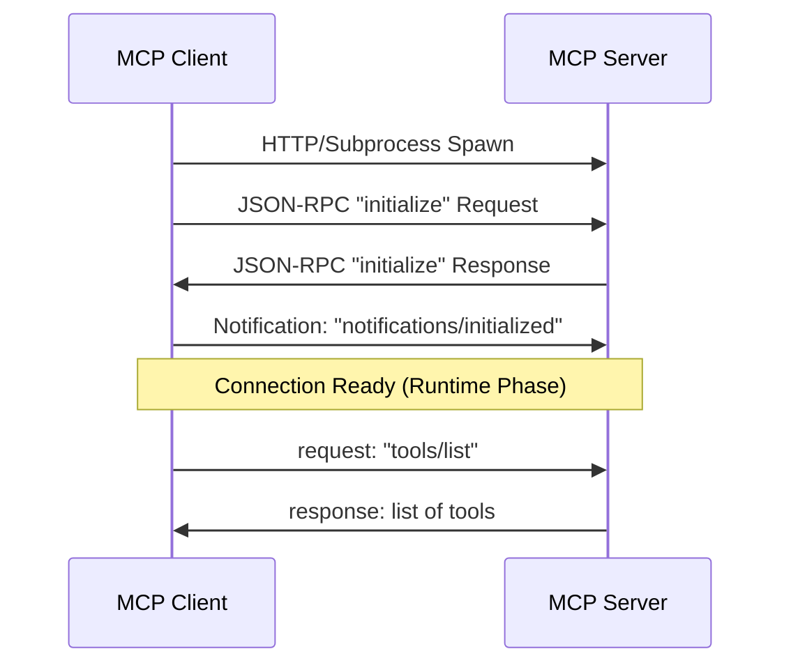

# Module 01: Model Context Protocol (MCP) Fundamentals

This module focuses on the core design principles, protocol definitions, communication mechanisms, and main abstractions of the Model Context Protocol (MCP).

---

## Technical Q&A

### Q1: What is the Model Context Protocol (MCP), and what architectural problem does it solve in agentic workflows?
**Answer:**
The **Model Context Protocol (MCP)** is an open standard designed to resolve the fragmentation in how Large Language Models (LLMs) connect to data sources, developer tools, and API environments. 

Before MCP, every developer platform or agent framework had to write custom integrations for every data source (e.g., a custom tool for GitHub, another for Postgres, another for Slack). This created an $M \times N$ integration problem (where $M$ is the number of agent systems/clients and $N$ is the number of tools/data sources). 

MCP establishes a clean **Client-Server architecture** using a uniform JSON-RPC protocol. 
- **MCP Client:** The coordinator (often an IDE like Claude Desktop or Cursor, or an agent framework like LangGraph) that hosts the LLM session and decides when to request tools or context.
- **MCP Server:** A lightweight microservice that exposes local files, databases, or API integrations as standardized capabilities.
- **Result:** Integrations are implemented once on the server, and any compliant client can instantly consume them, reducing the integration matrix to $M + N$.

---

### Q2: Explain the underlying transport layer options of MCP. How do Stdio and Server-Sent Events (SSE) differ, and when is each appropriate?
**Answer:**
MCP decouples the application protocol from the transport layer. The specification defines two standard transports:

1. **Stdio Transport (Standard Input/Output):**
   - **How it works:** The MCP client spawns the MCP server as a subprocess. Communication occurs over standard input (`stdin`) and standard output (`stdout`) streams. Standard error (`stderr`) is typically reserved for server logs and is bypassed by the protocol processor to avoid corrupting messages.
   - **Characteristics:** Zero-config networking, local execution only, process lifetime bound directly to the client.
   - **Use Case:** Local developer environments, IDE extensions (e.g., Claude Desktop executing local scripts).

2. **Server-Sent Events (SSE) Transport:**
   - **How it works:** An HTTP-based unidirectional streaming channel where the client initiates a connection. The server pushes structured JSON messages down an SSE stream (`text/event-stream`), while client-to-server payloads are sent via standard HTTP POST requests to a designated endpoint.
   - **Characteristics:** Support for remote network locations, handles authentication (headers, cookies) natively, supports multi-client configurations.
   - **Use Case:** Enterprise deployments, cloud-hosted agents, database tools hosted in separate virtual networks.

---

### Q3: Contrast the three primary primitives defined by the MCP specification: Resources, Prompts, and Tools.
**Answer:**

| Primitive | Definition | Execution Type | Primary Security Implication |
| :--- | :--- | :--- | :--- |
| **Resources** | Read-only context sources exposed to the client (e.g., file contents, database tables, logs). | Passive (Client requests read, server returns data). | Information disclosure; sensitive data exposure must be managed via scopes. |
| **Prompts** | Pre-defined templates or system guidelines designed to simplify LLM instructions (e.g., "Review Code", "SQL Assistant"). | Declarative (Client requests template, server returns prompt string). | Prompt injection; inputs must be sanitized before string interpolation. |
| **Tools** | Actionable, executable operations that the LLM can trigger to modify state or interact with external APIs. | Active (LLM invokes, server executes code, returns result). | Remote Code Execution (RCE), data deletion, rate limit exhaustion. Require explicit user approval. |

---

### Q4: Describe the step-by-step handshake and initialization sequence between an MCP client and an MCP server.
**Answer:**
To establish a connection, the client and server perform the following sequence:

1. **Connection Setup:** The client initiates the transport channel (spawns subprocess or opens SSE stream).
2. **Client Initialize Request:** The client sends an `initialize` JSON-RPC request containing:
   - Supported protocol version.
   - Client capabilities (e.g., does it support roots, sampling).
   - Client info (name, version).
3. **Server Initialize Response:** The server responds with:
   - Chosen protocol version.
   - Server capabilities (resources, prompts, tools).
   - Server info.
4. **Client Notification (initialized):** The client sends an `notifications/initialized` message (empty parameter notification) confirming that the connection is active and parameters are locked.
5. **Runtime Phase:** The client is now free to call server methods (`resources/list`, `prompts/list`, `tools/list`, or `tools/call`).

