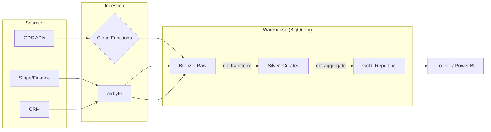

# Ingestion & Orchestration: The Polani GT Strategy

Polani GT needs to ingest 3rd party operational data. Here is the architectural approach using their requested stack.

---

## 1. Connector-Based Ingestion (Airbyte)
*   **Scenario:** Ingesting CRM data (Salesforce/HubSpot) or Transactional DBs (MySQL/PostgreSQL).
*   **Strategy:** Use Airbyte's **Incremental Sync** with CDC (Change Data Capture) if possible.
*   **Architecture:** `Source -> Airbyte -> GCS (Staging) -> BigQuery (Bronze)`.
*   **Talking Point:** "I prefer Airbyte for standard connectors because it saves months of custom code development, allowing me to focus on the 'Silver' and 'Gold' transformation layers where the real business value is."

## 2. Event-Driven Custom Ingestion (Cloud Functions)
*   **Scenario:** A GDS report (Amadeus/Sabre) arrives via FTP/Email and is dropped into a GCS Bucket.
*   **Strategy:** Cloud Storage Trigger -> Cloud Function (Python/Node) -> Parse & Load to BigQuery.
*   **Why:** For non-standard 3rd party data, standard connectors often fail. A Cloud Function can handle complex parsing, schema validation, and "Pre-landing" checks.
*   **Talking Point:** "For messy travel industry data, I use Cloud Functions to implement a 'Gatekeeper' pattern—validating the file structure before it ever touches the warehouse."

## 3. Transformation & Quality (dbt)
*   **Scenario:** Turning raw "Booking" records into a "Customer Lifetime Value" metric.
*   **Strategy:** Use dbt to define models in SQL.
*   **Key Features:**
    *   **Testing:** `dbt test` to ensure uniqueness, non-nulls, and referential integrity.
    *   **Documentation:** `dbt docs` to provide a clear lineage of how a number in a dashboard was calculated.
*   **Talking Point:** "I treat data transformations as software engineering. Using dbt allows for version control (Git), modularity, and automated testing, which are essential for a 'Data Architect' role."

## 4. Orchestration (Workflows / Composer)
*   **Concept:** Coordinating the Airbyte sync, the Cloud Function, and the dbt run.
*   **Strategy:** Use **Google Cloud Workflows** for simple, serverless orchestration or **Cloud Composer (Airflow)** for complex, multi-step dependencies.
*   **Talking Point:** "I design 'Idempotent' pipelines—if a job fails halfway through, re-running it won't result in duplicate data. This is achieved by using `MERGE` statements in SQL and clean staging environments."

---

## 5. Summary Architectural Pattern

